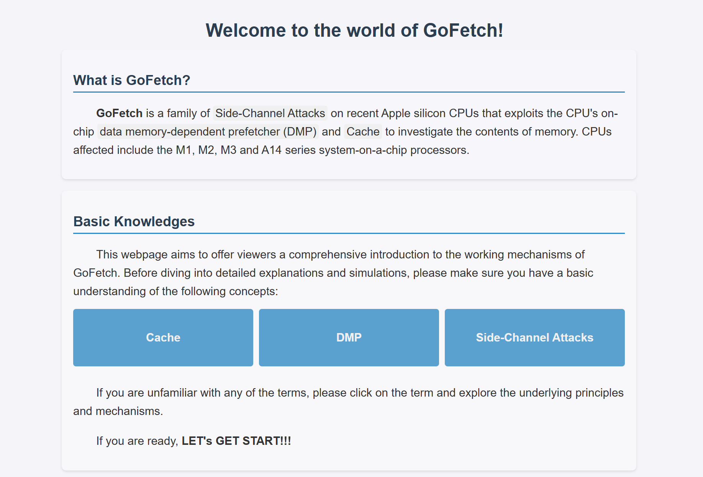
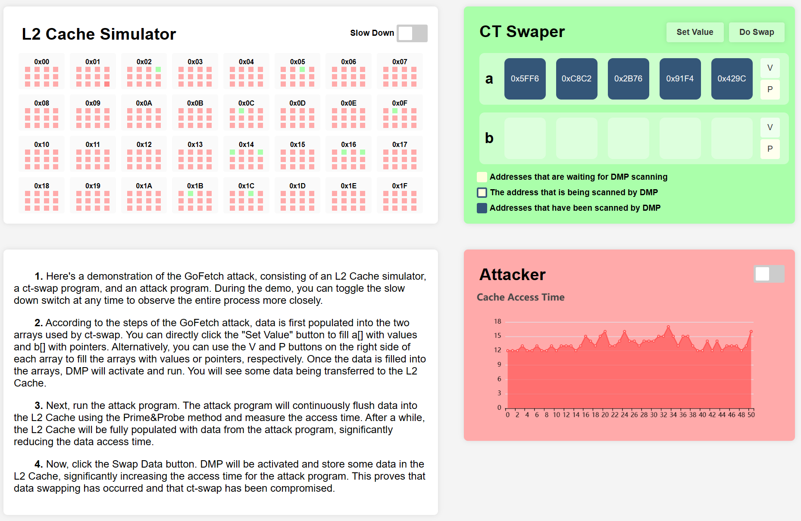

# NUS_SoC_SWS_2024_DOTA_GP5
The repo contains our works as Group 5 of Defense of The Ancient (SWS3011) in NUS SOC Summer Workshop 2024, whose instructor is [Prof. Norman Hugh Anderson](mailto:hugh@comp.nus.edu.sg). In our project, we explore the Side-Channel Attack of GoFetch revealed in 2024. We develop an educational website to comprehensively explain and visualize the concepts, and then implement mitigation methods on software level.

## Structure
This repository comprises the following artifacts:
```sh
.
├── webpage # educational website
├── experiment # evalutation
│   ├── blind.sh # run blind test
│   ├── init.sh  # check the environment
│   ├── miss.sh  # run performance loss test
│   └── src      # source codes
└── poc # attack & defense pocs
    ├── crypto_attacker   # attacker program
    ├── crypto_victim     # victim program (with detector)
    ├── evict-rs          # evict set gen lib
    ├── libaugury-ffi-sys # augury lib
    └── librsa-ffi-sys    # go's rsa lib
```

## Web Page

> [Link](https://chanbengz.github.io/DOTA/gofetch-introduction.html) to the online page

To demonstrate the concepts, we explain the introduction, background knowledges and provides interactive visualization for the attack schemes, also for background knowledge. Homepage



and the demo of GoFetch



## Set up Environment

### Install Rust & Setting

```sh
brew install rust
```

The high-resolution timing source used for experiments comes from performance counters. To configure and access the performance counter, in macOS, we load the dynamic library named `kperf`.

M2 and M3 have different L2 cache configurations. For M2 and M3 machines, go to `experiment/src/lib/basics/arch.h` and uncomment below.

```c
// uncomment below for M2 and M3
// #define M2 0
```

Run `sudo init.sh` script to set up the timer and use it to profile the latency of accessing data from L1, L2, DRAM (also the overhead of the measurement). 

>  [!NOTE]
>
> You need to re-do the timer set up every time you reboot the machine.


### DIT Bit Test (Quick Test)
Run `quick_check.out` to check whether setting the data independent timing bit ([DIT](https://developer.apple.com/documentation/xcode/writing-arm64-code-for-apple-platforms#Enable-DIT-for-constant-time-cryptographic-operations)) turns off the DMP. Argument `set_dit` is used to set (`set_dit=1`, disable DMP) or unset (`set_dit=0`, enable DMP) the DIT bit.

```
sudo ./src/quick_check.out <set_dit>
```

## Constant-Time Cryptography PoCs
From the understanding of how the DMP works, we develop a chosen-input attack, where the attacker engineers a secret-dependent pointer value in victim's memory (by giving the victim a chosen input to process) and exploit the DMP to deduce the secret from it. To this end, the attacker has to inspect the victim program:

* Spot the mixture of secret data and chosen input. Since the DMP only leaks pointer values, the attacker should have enough control over the mixture, such that the mixture could be a valid pointer value depending on the secret data.
* To confirm the DMP scanning over the mixture, one eviction set is required to evict the mixture (later on the victim reloads it from the memory) and the attacker needs the other eviction set to monitor whether the DMP dereferences the secret-dependent pointer (Prime+Probe channel). To get both of them,
    * The page offset of mixture address should be stable across runs and the space of eviction set candidates can shrink.
    * Cold, valid pages locating in the same 4GByte region as the mixture should be stable across runs. And the attacker will search the DMP prefetch target (pointed by the secret-dependent pointer) within these pages.
    * Having pre-knowledge in hand (page offset of mixture's address, address range to pick as secret-dependent pointer), the attacker has to force the mixture as the pointer (secret-independent) and try different combination of eviction sets until detect the DMP signal.

To show the idea, we build end-to-end key extraction PoCs for constant-time cryptographic implementations on Apple M1 machines running macOS.

### Constant-Time Conditional Swap
Constant-time conditional swap performs a swap between two arrays, `a` and `b`, depending on the secret `s` (`s=1` swap, `s=0` no swap). The attacker places the pointer in one of arrays (`a`), and target the other one (`b`) to see if the content of it triggers the DMP dereferencing the pointer, in other words, whether the swap happens.

**Determine the address of dyld cache:** the location of the dyld shared library is randomized for each boot time, so we need to run `dyld_search` every time reboot the machine.
```
cd crypto_attacker
cargo b -r --example dyld_search
./target/release/examples/dyld_search
```

**Run experiments:** Run the attacker and victim separately. The victim has one input argument, `<secret>`, it could be set as 1 or 0. The attacker has three arguments. In our example, we configure the attacker measures 32 samples for each chosen input, set the threshold of the Prime+Probe channel as 680 ticks and group 8 standard eviction sets as the eviction set for the mixture.

```sh
# attacker
cd crypto_attacker
cargo b -r --example ctswap_attacker
./target/release/examples/ctswap_attacker 32 680 8
# victim
cd crypto_victim
cargo b -r --example ctswap_victim
./target/release/examples/ctswap_victim <secret>
```

**Analyze leakage result:** The attacker records the time consumption of each stage in `ctswap_bench.txt` and Prime+Probe latency samples depending on victim's secret in `ctswap.txt`. Four real cryptographic examples below also record above benchmarking results.


### Go's RSA Encryption
Go's RSA implementation adopts Chinese Remainder Theorem to accelerate the decryption. One necessary step in the decryption procedure is a modular operation between chosen cipher `c` and secret prime `p` (or `q`), `c mod p`. By placing a pointer value in `c`, the mixture `c mod p` contains a secret-dependent pointer value.

**Run experiments:** Run the attacker and victim separately. Apart from the same three arguments as in [constant-time conditional swap](#constant-time-conditional-swap), the attacker has four additional inputs. In our example, we configure the attacker to search for target pointer from 0x14000400000 to 0x14000590000, determine one bit of guess after observing 3 positive DMP signals or 10 negative DMP signals.

```sh
# attacker
cd crypto_attacker
cargo b -r --example rsa_attacker --features rsa
./target/release/examples/rsa_attacker 32 680 8 0x14000400000 0x14000590000 3 10
# victim
cd crypto_victim
cargo b -r --example rsa_victim --features rsa
./target/release/examples/rsa_victim
```

**Analyze leakage result:** Run `python crypto_accuracy.py --crypto rsa` to analyze Prime+Probe latency of positive/negative DMP signals, and the accuracy of our attack.

## Evaluation

Based on our implementation of defenders, we examine the performance lost of each mitigation methods.

> [!WARNING]
>
> The DMP test should be done on a M3 machine. The rest experiment can be run on M1/M2.

- For performace loss test, since it only concerns the hardware, we adapt a common algorithm named Merge Sort to test the performance with DMP, without DMP and with efficiency core. Run `./miss.sh` to obtain the experiment data. Notice that the disabling DMP might fail due to the [Common Issues](#common-issues). If previous experiment is done and you'd like to skip, simply uncomment the codes will do.
- For Blinding test, we test the time comsumption of `ct-swap` and `go-rsa-decryption` and corresponding blinding techniques. To run the test, execute `./blind.sh` and see the results in data folders.
- For detection test, manually run

```sh
# victim
cd crypto_victim
cargo b -r --example ctswap_victim_with_detector
./target/release/examples/ctswap_victim_with_detector <secret>
```

and then start attacker to see the detection results.

## Common Issues

#### Segmentation Fault

Segmentation fault happens when the size of stack is not big enough to perform the eviction set generation algorithm. Run `ulimit -s 65520` to increase the stack size.

#### Assertion failed: ADDR_CHECK

To successfully dereference a pointer by the DMP, the pointer's position (where the pointer lives) and the pointer's target (where the pointer points to) should locate in the same 4Gbyte memory region. Assertion fails means the OS does not allocate memory satisfying above requirement. Just re-run the program.